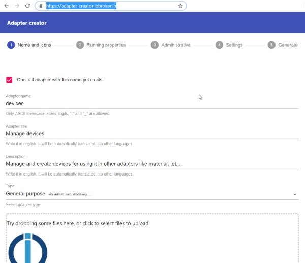

# Front-end for create adapter
!Repository is deprecated. Please go to https://www.iobroker.dev/create-adapter/wizard

The running instance can be found under [https://adapter-creator.iobroker.in/](https://adapter-creator.iobroker.in/)

This repo consist of two parts: 
- Front-end (./frontend)
- Back-end (./lambda)

It must be uploaded to AWS separately.
You can place into root directory config.json file with AWS credentials and frontend could be uploaded and invalidated with gulp script.

Update lambda via CLI:

`aws lambda update-function-code --function-name adapterCreator --zip-file fileb://lambda/lambda.zip`

To build and upload lambda just call `gulp && gulp uploadLambda` in root.

To build and upload frontend call `cd frontend && gulp`.
